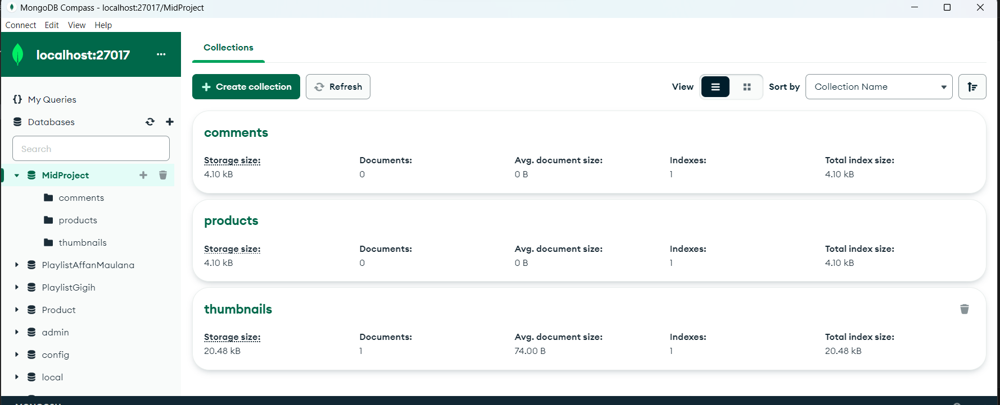
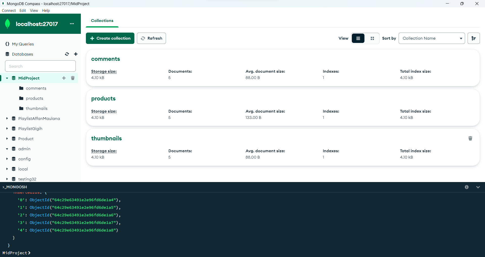

# Mid Term Project (Backend Only) - Affan Maulana ( GG3FSGP0241 )

## **How To Run!**

Before running the application, make sure you have the following installed on your system:

- Node.js
- MongoDB
- npm: Package manager for Node.js.
- Express.js: Web application framework for Node.js.
- Mongoose:Object Data Modeling (ODM) library for MongoDB and Node.js.

After everything is installed

- Open a terminal or command prompt on your computer.
  Use the git clone command to clone the repository.

  ```
  git clone https://github.com/KodingAffanMaulana/AffanMaulana_MidProject.git
  ```

- Navigate to the Project Directory: Change into the project directory by running:
  ```
  cd AffanMaulana_MidProject
  ```
- Install Dependencies : Use `npm install` to install the required dependencies mentioned in the "package.json" file

- Configure MongoDB URI: Rename [.env.example](.env.example) to `(.env)` and Replace the "mongodb://localhost:27017/MidProject" with your actual MongoDB URI if needed and adjust the location of the port.
  Run the API:

- To start the server, run the following command:
  `  npm run dev` The API will be running on `http://localhost:3000/`

- After running `npm run dev` the database and collection will be created automatically but still empty or you can create `mongosh use MidProject`
- To add it, you can directly insert a lot of code (insertmany) in the following file [dummyDatabase.js](/assets/dummyDatabase.js). You can also add data using the POST method.
  
- After the collection is successfully filled
  
- Screnshot Testing Method and Bonus [Here](/assets/screnshoots.md).
  You can use tools like Postman or cURL to test the API endpoints, such as GET /comments, POST /comments, etc.

##

## **Database Structure**

- ### Design Collection Comments

  ```
  {
      username: string
      comment: string
      videoID: string
      timestamp: datetime(iso 8601)
  }
  ```

  #### Schema

  ```
  {
      username: {
          type: String,
          required: true
      },
      comment: {
          type: String,
          required: true
      },
      videoID: {
          type: String,
          required: true
      },
      timestamp: {
          type: Date,
          default: Date.now()
      }
  }
  ```

- ### Design Collection Products

  ```
  {
      productID: string
      link: string
      title: string
      price: datetime(iso 8601)
      videoID: string
  }
  ```

  ### Schema

  ```
  {
      productID: {
          type: String,
          required: true
      },
      link: {
          type: String,
          required: true
      },
      title: {
          type: String,
          required: true
      },
      price: {
          type: Number,
          required: true
      },
      videoID: {
          type: String,
          required: true
      }
  }
  ```

- ### Thumbnails

  ### Design Collection

  ```
  {
      videoID: string
      imageUrl: string
  }
  ```

  ### Schema

  ```
  {
      videoID: {
          required: true,
          type: String,
      },
      imageUrl: {
          required: true,
          type: String
      }
  }
  ```
##
## **API Structure**

```
MidProject/
├── node_modules/
├── app/
│   ├── config/
│   │   └── config.js
│   ├── controllers/
│   │   ├── commentController.js
│   │   ├── productController.js
│   │   └── thumbnailController.js
│   ├── models/
│   │   ├── Comment.js
│   │   ├── Product.js
│   │   └── Thumbnail.js
│   └── routes/
│       ├── commentRoute.js
│       ├── productRoute.js
│       └── thumbnailRoute.js
├── app.js
└── package.json

```

##

## **API Request and Response**

`Base URL: http://localhost:3000`

### **Comments**

`GET /comments?videoID=id_video` : Get comments or filter comments by videoID

- Query Params : `?videoID=your_videoID`

- Link URL : `http://localhost:3000/comments?videoID=123` we use the query parameters videoID with value 123

- Headers : `Content-Type: application/json`

- Usage : `curl -X GET http://localhost:3000/comments?videoID=your_video_id`

- Response :

  - Success: (201)

  ```
  [
      {
          "_id": "64c27aff106809c18276874f",
          "username": "affan",
          "comment": "cuacanya bagus",
          "videoID": "123",
          "timestamp": "2023-07-27T14:11:00.119Z",
          "__v": 0
      }
  ]
  ```

  - Errors: (404)

  ```
  {
    "error": "No comments found for the specified VideoID"
  }
  ```

  - Errors: (500)

  ```
  {
    "error": "Internal server error
  }
  ```

##

`POST /comments` : Create a new comment`

- Link URL : `http://localhost:3000/comments`

- Data Params Raw JSON :

  ```
  {
      "username": "fathan",
      "comment": "satusssdfdfgddcom",
      "videoID": "321"
  }
  ```

- Headers : `Content-Type: application/json`

- Usage : `curl -X POST -H "Content-Type: application/json" -d '{
"username": "user123",
"comment": "Great video!",
"videoID": "your_video_id"
}' http://localhost:3000/comments`

- Response :

  - Success: (201)

    ```
    {
        "message": "Comment successfully created",
        "Comment": {
            "username": "fathan",
            "comment": "satusssdfdfgddcom",
            "videoID": "321",
            "timestamp": "2023-07-27T14:17:14.783Z",
            "_id": "64c282d49e21733b43a5a853",
            "__v": 0
        }
    }
    ```

  - Errors: (404)

    ```
    {
        "error": "Comment with the same username and videoID already exists"
    }
    ```

  - Errors: (500)

    ```
    {
        "error": "Internal server error
    }
    ```

##

### **Products**

`GET /products?videoID=id_video` : Get product data by videoID

- Query Params : `?videoID=your_videoID`

- Link URL : `http://localhost:3000/products?videoID=123` we use the query parameters videoID with value 123

- Headers : `Content-Type: application/json`

- Usage : `curl -X GET http://localhost:3000/products?videoID=your_video_id`

- Response :

  - Success: (201)

    ```
    [
        {
            "_id": "64c288581a0ee9ea3f0dd2bb",
            "productID": "af123",
            "link": "satusdfdfg.com",
            "title": "roti",
            "price": 12334,
            "videoID": "123",
            "__v": 0
        }
    ]
    ```

  - Errors: (404)

    ```
    {
        "error": "No products found for the specified VideoID or search term"
    }
    ```

  - Errors: (500)

    ```
    {
        "error": "Internal server error
    }
    ```

##

`POST /products`: Create a new product. (Optional)

- Link URL : `http://localhost:3000/products`

- Data Params Raw JSON :

  ```
  {
    "productID": "af123",
    "link": "satusdfdfg.com",
    "title": "roti",
    "price": 12334,
    "videoID": "123"
  }
  ```

- Headers : `Content-Type: application/json`

- Usage : `curl -X POST -H "Content-Type: application/json" -d '{
"productID": "af123",
"link": "https://satusdfdfg.com",
"title": "Roti",
"price": 12334,
"videoID": "123"
}' http://localhost:3000/products`

- Response :

  - Success: (201)

    ```
    {
        "message": "Product added successfully",
        "product": {
            "productID": "af123",
            "link": "satusdfdfg.com",
            "title": "roti",
            "price": 12334,
            "videoID": "123",
            "_id": "64c288581a0ee9ea3f0dd2bb",
            "__v": 0
        }
    }
    ```

  - Errors: (404)

    ```
    {
        "error": "ProductID, Link, Title, Price, and VideoID are required"
    }
    ```

  - Errors: (500)

    ```
    {
        "error": "Internal server error
    }
    ```

##

### **Thumbnails**

`GET /products` : Get Thumbnail datas by videoID

- Query Params : None

- Link URL : `http://localhost:3000/thumbnails`

- Headers : `Content-Type: application/json`

- Usage : `curl -X GET http://localhost:3000/thumbnails`

- Response :

  - Success: (201)

    ```
    [
        {
            "_id": "64c28acb1a0ee9ea3f0dd2bf",
            "videoID": "123",
            "imageUrl": "FFSFSdsfF.com",
            "__v": 0
        },
        {
            "_id": "64c28ae61a0ee9ea3f0dd2c2",
            "videoID": "132",
            "imageUrl": "ajiadji.com",
            "__v": 0
        },
        {
            "_id": "64c28b071a0ee9ea3f0dd2c5",
            "videoID": "456",
            "imageUrl": "testing.com",
            "__v": 0
        },
        // More thumbnails...
    ]
    ```

  - Errors: (404)

    ```
    {
        "error": "No thumbnails found"
    }
    ```

  - Errors: (500)

    ```
    {
        "error": "Internal server error
    }
    ```

##

`POST /thumbnails` : Add a new thumbnail (optional)

- URL Params : None

- Data Params Raw JSON :

  ```
  {
      "videoID": "136",
      "imageUrl": "FFSFSdsfF"
  }
  ```

- Headers : `Content-Type: application/json`

- Usage : `curl -X POST -H "Content-Type: application/json" -d '{
"videoID": "136",
"imageUrl": "https://example.com/thumbnail_image.jpg"
}' http://localhost:3000/thumbnails`

- Response :

  - Success: (201)

    ```
    {
        "message": "Thumbnail added successfully",
        "thumbnails": {
            "videoID": "456",
            "imageUrl": "testing.com",
            "_id": "64c28b071a0ee9ea3f0dd2c5",
            "__v": 0
        }
    }
    ```

  - Errors: (404)

    ```
    {
        "error": "VideoID and URL are required"
    }
    ```

  - Errors: (500)

    ```
    {
        "error": "Internal server error
    }
    ```

##

### Bonus

`GET /products/title?title=product_title` : Get Thumbnail datas by videoID

- Query Params : `?title=product_title`, query parameter title with the value of the product you want to search for, which will be used to search for products based on that title.

- Link URL : `http://localhost:3000/products/title?title=Product 2` we use the query parameters title with value title Product 2

- Data Params : none

- Headers : `Content-Type: application/json`

- Usage : `curl -X GET "http://localhost:3000/products/title?title=Product%202" -H "Content-Type: application/json"`

- Response :

  - Success: (201)

    ```
    [
        {
            "_id": "64c29e63491e2e96fd6de1a0",
            "productID": "prod002",
            "link": "https://example.com/product2",
            "title": "Product 2",
            "price": 200,
            "videoID": "123"
        }

    ]
    ```

  - Errors: (404)

    ```
    {
        "error": "No products found for the specified search term"
    }
    ```

  - Errors: (500)

    ```
    {
        "error": "Internal server error
    }
    ```

##
